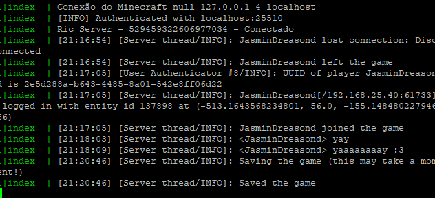

# Tiny-RconCord
Minecraft and Discord connected in a application :D

Module inspired by this repository https://github.com/destruc7i0n/shulker.

## Discord + Minecraft = Perfect~ <3

This module gives you the possibility to mount a rcon server using your Discord server.

Completely easy to configure, you just need to modify the data inside the `config.json` file.

Specially made to work with Minecraft Vanilla (But you can edit the settings to adapt to any other type of server).

Open the folder Tiny-RconCord for more information...

## Installing
You just need to use the command `npm install` and edit the config.json inside the Tiny-RconCord folder. 

If you have npm plugins to install inside the app, use npm commands here too.

## Images

### Discord Chat

### Log Chat

### Console Node
